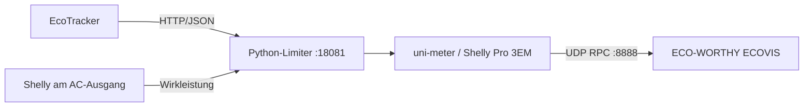

# EcoTracker als Shelly Pro 3EM für ECO-WORTHY ECOVIS

Der ECOVIS 2400 (Typenschild: `ECO-BPS2400WDZ`) akzeptiert als Smart Meter einen
Shelly Pro 3EM. Dieses Projekt stellt mit
[`uni-meter`](https://github.com/sdeigm/uni-meter) einen kompatiblen virtuellen
Zähler bereit, der aus den lokalen Daten eines everHome EcoTracker gespeist
wird. Ein vorgeschalteter Limiter nutzt zusätzlich einen Shelly am AC-Ausgang,
um die abgegebene Leistung gedämpft zu regeln.

Getesteter Stand: Limiter **2.1.1**, `sdeigm/uni-meter:1.5.0` und
ECO-WORTHY ECOVIS 2400.

## Datenfluss



Der Limiter meldet nicht die real anliegende Netzleistung, sondern den Wert, den
der ECOVIS *sehen soll*, damit er die gewünschte Ausgangsleistung einstellt.

## Warum die erste Fassung geschwungen hat

Die ursprüngliche Rechnung war:

```text
Korrekturwert = Zielleistung − aktuelle ECOVIS-Leistung
```

Das ist ein Deadbeat-Regler. Er kommandiert in einem Schritt die komplette
Differenz und setzt voraus, dass der Wechselrichter sie sofort umsetzt und die
Messung sie sofort zurückmeldet. Beides trifft nicht zu.

Zwei Eigenschaften der Strecke machen das zum Problem:

**Der ECOVIS wirkt wie ein Integrator.** Er verschiebt seine Leistung solange,
wie ein Wert ungleich Null gemeldet wird. Ein konstant gemeldeter Wert führt
also nicht zu einer einmaligen Änderung, sondern zu einer fortlaufenden.

**Die Schleife hat Totzeit.** Aktualisierungsintervall des EcoTracker, Intervall
des Shelly am AC-Ausgang, Abfrageintervall und interne Trägheit des ECOVIS
summieren sich. Solange diese Zeit nicht abgelaufen ist, sieht der Limiter die
Wirkung seiner eigenen Korrektur noch nicht.

Zusammen heißt das: Die gleiche Differenz wird mehrfach gemeldet und vom ECOVIS
aufaddiert. Das Ergebnis waren die gemessenen 1.339 W bei einem Sollwert von
800 W, gefolgt vom Einbruch in die Gegenrichtung.

Die symmetrische Klemmung auf ±250 W hat zusätzlich geschadet: Sie begrenzte
auch das Absenken, also genau den Vorgang, der ein Überschwingen einfängt.

## Wie die neue Regelung arbeitet

**Verstärkung auf die Totzeit normiert.** `KP_UP` und `KP_DOWN` sind nicht der
Anteil pro Abtastung, sondern der Anteil der Differenz, der sich über das ganze
Totzeitfenster `SETTLE_S` aufsummiert. Intern gilt:

```python
ticks   = SETTLE_S / POLL_INTERVAL
control = error * KP / (ticks + 1)
```

Damit wird die Korrektur heuristisch über das angenommene Totzeitfenster
verteilt. Das tatsächliche Verhalten hängt zusätzlich vom Abfrageintervall und
dem internen Regler des ECOVIS ab. Die voreingestellten `KP`-Werte unter 1.0
sind deshalb bewusst konservativ gewählt und müssen im Feld geprüft werden.

**Asymmetrie.** Absenken darf kräftiger zugreifen als Anheben (0.70 gegen 0.40).
Ein zu langsamer Anstieg kostet ein paar Sekunden Netzbezug, ein zu langsames
Absenken kostet Einspeisung und Grenzüberschreitung.

**Totband.** Abweichungen unter `DEADBAND_W` führen zu 0 W Korrektur. Der
ECOVIS hält seine Leistung, statt permanent um Messrauschen herumzuwackeln. Das
erzeugt eine bleibende Regelabweichung von einigen Watt unterhalb des Sollwerts
— in dieser Richtung ist das erwünscht.

**Notzweig.** Überschreitet die gemessene Ausgangsleistung `HARD_LIMIT_W`,
werden Dämpfung und Totband übersprungen und mit `HARD_GAIN` gegengesteuert.
Auch dieser Zweig ist totzeitnormiert — eine ungedämpfte Notbremse erzeugt sonst
nur einen Grenzzyklus zwischen Überschreitung und Totalausfall. Er arbeitet mit
dem ungeglätteten Messwert, damit er früh greift.

**Ausfallverhalten.** Fehlen EcoTracker- oder Shelly-Daten länger als `STALE_S`,
meldet der Limiter dauerhaft Einspeisung (`SAFE_CONTROL_W`), was den ECOVIS
herunterregelt. Nach `STALE_HARD_S` wird auf den maximalen negativen Wert
umgeschaltet. Beim Start gilt sofort `failsafe_hard`, bis erstmals gültige Daten
vorliegen.

### Simuliertes Verhalten

Gegen eine Streckennachbildung (Integrator, drei Takte Totzeit, `MAX_OUTPUT_W`
= 740, `SETTLE_S` = 3.0):

| Szenario | Spitzenwert | Endwert | Einspeisung |
|---|---|---|---|
| Hauslast konstant 2.000 W | 742 W | 742 W | keine |
| Lastsprung 400 → 2.000 W | 739 W | 739 W | keine |
| Lastabwurf 2.000 → 150 W | 742 W | 147 W | kurzer Transient |
| Rauschen ±120 W um 900 W | 742 W | 730 W | minimal |
| Totzeit doppelt so groß wie eingestellt | 902 W | 801 W | keine |
| Totzeit nur ein Drittel des eingestellten Werts | 730 W | 730 W | keine |

Der Anstieg auf volle Leistung dauert rund 12 Takte, also etwa 12 Sekunden bei
`POLL_INTERVAL = 1.0`. Für einen Hausspeicher ist das unkritisch.

Bemerkenswert sind die letzten beiden Zeilen: Eine überschätzte Totzeit macht
die Regelung nur träge, eine unterschätzte führt zu Überschreitung. `SETTLE_S`
im Zweifel also lieber zu groß wählen.

Der Transient beim Lastabwurf lässt sich nicht wegregeln. Wenn 1.850 W Last
schlagartig verschwinden, speist der Speicher zwangsläufig ein, bis die Messkette
das gemeldet hat. Das ist die Totzeit selbst, keine Reglerschwäche.

## Voraussetzungen

- Linux-Rechner im gleichen IPv4-Netz wie EcoTracker und ECOVIS
- Docker Engine mit Docker Compose
- freier TCP-Port 80 und UDP-Port 8888 auf dem Docker-Host
- EcoTracker mit erreichbarer lokaler API
- Shelly mit Leistungsmessung am AC-Ausgang des ECOVIS

Die Container verwenden `network_mode: host`, weil UDP-Broadcast und mDNS sonst
nicht zuverlässig funktionieren.

## Installation

Repository klonen und die Beispielkonfiguration kopieren:

```bash
git clone https://github.com/starbase64/ecotracker-ecovis-shelly-simulator.git
cd ecotracker-ecovis-shelly-simulator
cp .env.example .env
nano .env
```

In `.env` die lokalen URLs von EcoTracker und Shelly eintragen. Anschließend:

```bash
docker compose up -d
docker compose logs -f ecotracker-limiter
```

Der Limiter braucht keine externen Pakete und läuft unverändert in
`python:3.13-alpine`.

In der ECO-WORTHY-App unter **Stromzähler** den angezeigten Broadcast-Endpunkt
mit Port `8888` verwenden, beispielsweise `192.168.1.255:8888`. Der ECOVIS
sendet danach `EM.GetStatus`-Anfragen per UDP; `uni-meter` antwortet als
virtueller Shelly Pro 3EM.

## Konfiguration

Alle Parameter werden als Umgebungsvariablen im Compose-File gesetzt.

### Datenquellen

| Variable | Standard | Bedeutung |
|---|---|---|
| `ECOTRACKER_URL` | in `.env` erforderlich | lokale EcoTracker-Schnittstelle |
| `INVERTER_URL` | in `.env` erforderlich | Shelly am AC-Ausgang des ECOVIS |
| `INVERTER_FIELD` | `apower` | Punkt-Pfad zum Leistungswert, Gen1 z. B. `meters.0.power` |
| `INVERTER_INVERT` | `true` | Vorzeichen drehen, weil der verwendete Shelly Erzeugung negativ meldet |
| `HTTP_TIMEOUT` | `1.5` | Zeitlimit je Abfrage in Sekunden |
| `ECOTRACKER_MAX_AGE_MS` | `5000` | maximal erlaubtes Alter von `agePower`; danach Failsafe |
| `LISTEN_HOST` / `LISTEN_PORT` | `127.0.0.1` / `18081` | eigener Endpunkt für uni-meter |

### Leistungsgrenzen

| Variable | Standard | Bedeutung |
|---|---|---|
| `MAX_OUTPUT_W` | `740` | Sollwert-Deckel, mit Reserve unter 800 W |
| `HARD_LIMIT_W` | `790` | ab hier greift der Notzweig; keine zertifizierte Hartbegrenzung |
| `HARD_GAIN` | `2.0` | Verstärkung im Notzweig, ebenfalls totzeitnormiert |
| `HARD_MIN_PUSH_W` | `30` | Mindest-Korrektur im Notzweig |

### Regler

| Variable | Standard | Bedeutung |
|---|---|---|
| `SETTLE_S` | `3.0` | **gemessene Totzeit der Strecke — wichtigster Parameter** |
| `KP_UP` | `0.40` | Schleifenverstärkung beim Anheben, muss < 1.0 bleiben |
| `KP_DOWN` | `0.70` | Schleifenverstärkung beim Absenken, muss < 1.0 bleiben |
| `DEADBAND_W` | `15` | Totband um den Sollwert |
| `MAX_RAISE_SIGNAL_W` | `200` | Deckel für positive Korrekturen (Fangnetz) |
| `MAX_REDUCE_SIGNAL_W` | `800` | Deckel für negative Korrekturen (Fangnetz) |
| `GRID_EMA_ALPHA` | `0.6` | Glättung Netzleistung, 1.0 = keine Glättung |
| `INV_EMA_ALPHA` | `0.6` | Glättung Ausgangsleistung |
| `POLL_INTERVAL` | `1.0` | Abtastintervall in Sekunden |

### Betrieb

| Variable | Standard | Bedeutung |
|---|---|---|
| `ENABLED` | `true` | `false` = Durchleitbetrieb, Netzwert unverändert, keine Begrenzung |
| `STALE_S` | `5` | ab dieser Datenalterung greift das Ausfallverhalten |
| `STALE_HARD_S` | `15` | ab hier maximale Absenkung |
| `SAFE_CONTROL_W` | `-300` | gemeldeter Wert im Ausfall |
| `LOG_INTERVAL` | `5.0` | Abstand der Statuszeilen im Log |

## Einmessen

`SETTLE_S` ist geräteabhängig und der einzige Parameter, den du wirklich messen
musst. Alles andere kann auf den Standardwerten bleiben.

**Schritt 1 — Abfrageintervall des ECOVIS ermitteln.** Er fragt per
UDP-Broadcast ab, nicht über mDNS:

```bash
tcpdump -i any -n udp port 8888
```

Ein `POLL_INTERVAL` deutlich unter diesem Intervall bringt nichts.

**Schritt 2 — Totzeit messen.** Limiter mit `ENABLED=false` starten und parallel
den Rohwert des Shelly mitschreiben:

```bash
while true; do
  date +%H:%M:%S.%N | cut -c1-12 | tr '\n' ' '
  curl -s 'http://SHELLY-IP/rpc/Switch.GetStatus?id=0' \
    | python3 -c 'import json,sys; print(json.load(sys.stdin)["apower"])'
  sleep 0.5
done
```

Eine bekannte Last einschalten (Wasserkocher o. ä.) und die Zeit zwischen
Lastsprung und dem Moment messen, in dem die ECOVIS-Leistung ihren neuen Wert
erreicht hat.

**Schritt 3 — Wert eintragen,** eher großzügig aufgerundet. Die Simulation oben
zeigt: Überschätzen kostet nur Reaktionszeit, Unterschätzen kostet Sicherheit.

Wenn es danach noch pendelt, in dieser Reihenfolge nachziehen: `SETTLE_S`
erhöhen, dann `KP_UP` senken, dann `KP_DOWN` senken. Die Glättungsfaktoren
zuletzt anfassen — sie erkaufen Ruhe mit zusätzlichem Verzug und können das
Schwingen dadurch verschlimmern.

## Kontrolle im Betrieb

Alle wesentlichen Prüfungen auf einmal:

```bash
./check.sh
```

Oder den Limiter direkt abfragen:

```bash
curl -s http://127.0.0.1:18081/v1/json | python3 -m json.tool
```

Fortlaufend im Terminal:

```bash
while true; do
  curl -s 'http://127.0.0.1:18081/v1/json' |
  python3 -c 'import json,sys; d=json.load(sys.stdin); print("Netz={:7.1f} W | ECOVIS={:7.1f} W | Haus={:7.1f} W | Ziel={:7.1f} W | Korrektur={:7.1f} W | {}".format(d["limiterGridPower"] or 0, d["limiterInverterPower"] or 0, d["limiterHouseLoad"] or 0, d["limiterTargetPower"] or 0, d["limiterControlPower"], d["limiterState"]))'
  sleep 2
done
```

Dieselben Zeilen schreibt der Container alle `LOG_INTERVAL` Sekunden ins Log.

`limiterState` zeigt, was die Regelung gerade tut:

| Wert | Bedeutung |
|---|---|
| `hold` | im Totband, Leistung wird gehalten |
| `raise` | Anhebung, Hauslast unterhalb des Deckels |
| `ceiling` | Anhebung, aber durch `MAX_OUTPUT_W` begrenzt |
| `reduce` | Absenkung |
| `overshoot` | Notzweig aktiv, Ausgangsleistung über `HARD_LIMIT_W` |
| `failsafe` | Datenquelle veraltet |
| `failsafe_hard` | Datenquelle länger ausgefallen oder noch nie gelesen |
| `passthrough` | Begrenzung deaktiviert |

Häufiges `overshoot` oder ein Wechsel zwischen `raise` und `reduce` im
Sekundentakt heißt: `SETTLE_S` ist zu klein. Der Limiter meldet das nach zehn
Auslösungen auch selbst im Log.

## uni-meter

In der `uni-meter.conf` zeigt die Quelle auf den Limiter statt direkt auf den
EcoTracker:

```hocon
url = "http://127.0.0.1:18081/v1/json"
```

Und der UDP-Port muss auf 8888 stehen:

```hocon
udp-port = 8888
```

Der Limiter liefert dasselbe JSON-Format wie der EcoTracker. `power` und
`powerPhase1..3` enthalten den Korrekturwert (die Phasen jeweils ein Drittel,
damit Summe und Gesamtwert zusammenpassen). Die Energiezähler des EcoTracker
werden unverändert durchgereicht. Zusätzliche Felder mit dem Präfix `limiter`
dienen nur der Diagnose und stören uni-meter nicht.

## Grenzen und Sicherheitshinweise

> [!WARNING]
> Dieses Projekt ist eine experimentelle Software-Regelung. Es ist keine
> zertifizierte Leistungsbegrenzung und ersetzt weder Herstellerfreigaben noch
> die technischen Anschlussregeln und Vorgaben des Netzbetreibers.

**AC-Laden muss getrennt betrachtet werden.** Der verwendete Shelly liefert
eine vorzeichenbehaftete Wirkleistung: Erzeugung wurde im Test negativ
gemeldet. Mit `INVERTER_INVERT=true` wird Einspeisung im Regler positiv und
AC-Bezug negativ dargestellt. Der signierte Wert fliesst in die
Hauslastberechnung ein; fuer Leistungsdeckel und Notzweig wird nur die
tatsaechliche Erzeugung verwendet. Netzladen sollte waehrend der Regelung
trotzdem deaktiviert bleiben, weil gleichzeitiges Laden und Regeln zu
unerwuenschten Betriebswechseln fuehren kann.

**Zusätzliche harte Abschaltung empfohlen.** Der Limiter schützt nicht gegen
seinen eigenen Ausfall auf Ebene des Docker-Hosts. Ein Skript direkt auf dem
Shelly, das bei anhaltender Überschreitung (etwa über 900 W für mehr als 30 s)
abschaltet, läuft unabhängig davon weiter. Vorher testen, wie sich der ECOVIS
verhält, wenn gar keine Antworten mehr kommen: Hält er den letzten Wert, ist
diese Absicherung nicht optional.

**Die Simulationswerte sind kein Feldtest.** Die Streckennachbildung nimmt an,
dass der ECOVIS den gemeldeten Wert vollständig und linear umsetzt. Wie er sich
real verhält, ist nicht dokumentiert. Die Zahlen oben zeigen, dass die Auslegung
in sich stimmt — sie ersetzen keine Messung am Gerät.

**Keine zertifizierte Begrenzung.** Das ist eine selbst gebaute
Softwarebegrenzung und ersetzt keine herstellerseitige Leistungsbegrenzung. Wer
die Anlage mit 800 W im Marktstammdatenregister anmeldet, sollte wissen, dass
das Gerät diese Grenze ohne dieses Setup nicht einhält. Für den dauerhaften
Netzbetrieb gelten die technischen Anschlussregeln und die Vorgaben des
Netzbetreibers.

## Mögliche Erweiterung: MQTT

Für MQTT wäre `paho-mqtt` nötig, also ein eigenes Image oder ein `pip install`
im Startkommando — der Limiter kommt bewusst ohne externe Abhängigkeiten aus.
Sinnvolle Themen wären:

```text
ecoworthy/set/max_power      -> MAX_OUTPUT_W zur Laufzeit ändern
ecoworthy/set/enabled        -> Begrenzung ein/aus
ecoworthy/state/grid_power
ecoworthy/state/output_power
ecoworthy/state/target_power
ecoworthy/state/control_power
ecoworthy/state/limiter_state
```

MQTT würde dabei nicht den ECOVIS steuern, sondern die Parameter des Limiters.
Die Vorgaben erreichen den ECOVIS weiterhin ausschließlich über das simulierte
Shelly-Pro-3EM-Protokoll.

## Lizenz

Der Python-Limiter und die Projektdateien stehen unter der [MIT-Lizenz](LICENSE).
`uni-meter` ist ein eigenständiges Projekt und wird nur als Docker-Image
verwendet; dafür gelten dessen eigene Lizenzbedingungen.
